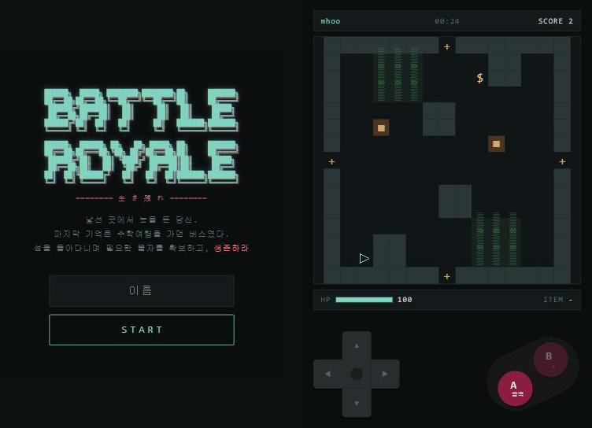

# BATTLE ROYALE

[](https://github.com/mhoo999/battle-royal/actions/workflows/ci.yml)

모바일 브라우저에서 하는 **실시간 2D 서바이벌 PvP**. 영화 *배틀 로얄*에서 가져온 설정:
수학여행 버스에서 잠든 반 아이들이 낯선 섬에서 눈을 뜬다. 가방 속 무기는 운이다 —
권총을 쥘 수도, 숟가락을 쥘 수도 있다.

**서버가 모든 판정을 내리는 실시간 멀티플레이 구조**와 **AWS 배포**를 목표로 한
포트폴리오 프로젝트다.



---

## 게임

- 방이 문으로 이어진 세계를 돌아다니며 다른 플레이어를 만난다. 라운드도 승자도 없는
  **영속 월드**다. 오래 살아남고, 많이 맞히고, 많이 쓰러뜨리면 점수가 오른다.
- 아이템은 **한 개만** 든다. 바닥의 아이템은 전부 `$`로 보여서, 주워 봐야 무엇인지
  안다. 진짜 무기(칼·야구배트·석궁·권총)는 방 8개에 하나꼴이고, 나머지는 컵이나 솜
  빠진 인형 같은 잡템이다. 빈손이면 주먹으로 싸운다.
- 총은 재장전이 없다. 마지막 탄을 쏘면 사라진다.
- **부시**에 들어가면 밖에서 안 보이고, **캐비닛**에 숨으면 총알도 막는다. 대신
  캐비닛 안에서는 공격할 수 없다.
- 조작: 방향키 + **A**(들고 있는 것 사용) + **B**(줍기, 문). 키보드는 방향키, J, K.

`△` 나 · `▲` 상대 · `$` 아이템 · `■` 캐비닛 · `▒` 부시 · `+` 문

---

## 기술적으로 신경 쓴 것

**서버 권위(server-authoritative).** 클라이언트는 `MOVE`, `ACTION_A`, `ACTION_B` 같은
**의도**만 보낸다. 위치·HP·데미지·인벤토리는 서버만 바꾼다. 위조 프레임
(`SET_HP`, 좌표가 담긴 `MOVE`)이 무시되는지를 E2E 테스트가 확인한다.

**단일 게임 루프 스레드.** 20Hz 루프 스레드 하나가 모든 방 상태를 바꾼다. WebSocket
스레드는 명령을 큐에 넣기만 하고, 스레드 경계는 `RoomRegistry` 한 곳뿐이다. 락이 없다.

**플레이어별 가시성 필터.** 스냅샷은 받는 사람마다 따로 만든다. 상대의 HP, 무기, 탄약,
캐비닛 점유 여부, 다른 부시에 숨은 사람, 바닥 아이템의 종류는 **아예 전송하지 않는다**.
개발자 도구로도 볼 수 없다. 상대 정보는 타입(`Snapshot.Other`: id, 위치, 방향, 생존)으로
제한해서, 필드를 추가하면 테스트가 깨진다.

**즉시 판정 사격.** 총알을 움직이는 개체로 만들지 않고, 쏘는 순간 타일 단위로 스캔한다.
터널링이나 보간 문제가 없다. 경로는 사수의 칸에서 시작하므로, 부시에서 쏘면 위치가
드러난다.

**측정으로 정한 수치.** 방 개수를 인원수로 제한한 그래프 월드에서 "문이 사람 있는 방으로
열릴 확률"을 시뮬레이션 60쌍으로 측정해 정했다(평균 2.8번의 문 통과로 조우, 최악 14번,
문 방향 일치 98%). 테스트가 결정적이도록 방 순회 순서를 삽입 순서로 고정했다
(`HashSet` 순서 때문에 같은 코드로 측정값이 10~16으로 흔들린 적이 있다). CI에서
코드 변경 없이 테스트가 실패한 것을 추적해, 문 목록을 담은 `Map.copyOf`가 JVM마다 다른
순서(해시 salt)로 순회된다는 것도 찾아 고쳤다.

**끊김 유예.** 소켓이 끊겨도 플레이어는 15초간 월드에 남는다(도망 방지). 같은 토큰으로
다시 붙으면 같은 자리로 복귀하고, 새로고침해도 복귀한다.

---

## 아키텍처

```
game/core, game/rule   순수 Java. Spring 의존 없음, 결정적
       │
game/loop              20Hz 단일 스레드. 모든 상태 변경의 주인
       │
ws                     플레이어별 필터링, 직렬화
       │
client                 스냅샷을 그리기만 한다. 예측 없음
```

- 실시간 상태(방, 플레이어, 아이템)는 **메모리에만** 있다. DB에는 게임 결과와 랭킹만
  쓴다. 매 틱 상태를 DB에 쓰지 않는다.
- HTTP: 페이지, 세션 생성, 랭킹 / WebSocket: 이동, 공격, 아이템, 방 이동, 스냅샷
- 렌더러는 CSS Grid 셀로 그린다(`<pre>` 한 덩어리가 아님). 규칙을 건드리지 않고
  교체할 수 있다.

### 배포 (진행 중)

```
브라우저 ─ HTTP ─▶ EC2 [ Nginx ─▶ Spring Boot (127.0.0.1:8080, systemd) ] ─▶ RDS MySQL
```

EC2 한 대 + RDS로 시작한다. ALB와 Redis는 서버가 두 대 이상 필요해질 때까지 넣지 않는다.
단계별 진행과 결정 기록은 [docs/AWS_DEPLOYMENT.md](docs/AWS_DEPLOYMENT.md).

---

## 기술 스택

| | |
|---|---|
| 서버 | Java 21, Spring Boot 4.1, Spring WebSocket, Spring Data JPA |
| DB | H2(로컬), MySQL 8.0(운영, RDS) |
| 클라이언트 | 순수 HTML/CSS/JS, 빌드 단계 없음 |
| 테스트 | JUnit 5, Node 내장 WebSocket으로 만든 의존성 없는 E2E 스모크 |
| CI | GitHub Actions — 단위 테스트, 실제 서버를 띄운 소켓 스모크, jar 빌드 |
| 배포 | AWS EC2, RDS, Nginx, systemd |

---

## 실행

Java 21이 필요하다.

```bash
./gradlew bootRun              # http://localhost:8080
./gradlew test                 # 단위 테스트
node e2e/smoke-two-sockets.mjs # 서버가 떠 있을 때, 두 소켓 E2E (Node 18+)
```

브라우저 탭 두 개로 접속하면 둘이 같은 월드에서 만난다.

---

## 문서

| 문서 | 내용 |
|---|---|
| [docs/PRD.md](docs/PRD.md) | 무엇을 만드는가 |
| [docs/GAME_RULES.md](docs/GAME_RULES.md) | 게임 규칙과 모든 수치 |
| [docs/NETWORK_PROTOCOL.md](docs/NETWORK_PROTOCOL.md) | 이벤트, 페이로드, 가시성 필터 |
| [docs/ARCHITECTURE.md](docs/ARCHITECTURE.md) | 구조와 패키지 |
| [docs/AWS_DEPLOYMENT.md](docs/AWS_DEPLOYMENT.md) | AWS 배포 단계와 기록 |
| [progress.md](progress.md) | 지금까지 한 것, 다음 할 것, 결정 기록 |
